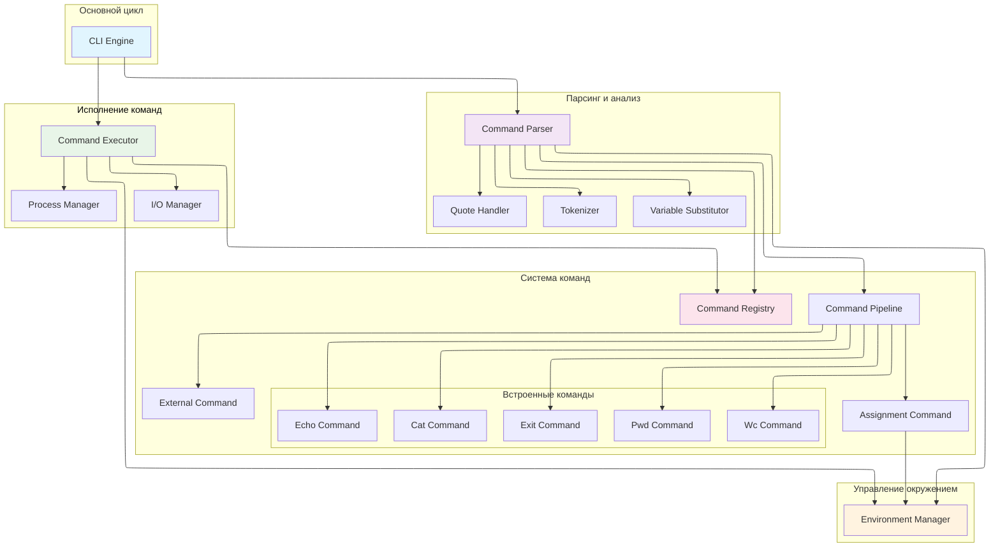

# Архитектура простого интерпретатора командной строки

## Общая структурная схема системы



## Описание архитектурных компонентов

### 1. CLI Engine (Основной цикл)
**Ответственность**: Управление основным циклом работы интерпретатора, координация работы всех компонентов системы.

**Основные функции**:
- Отображение приглашения командной строки
- Чтение пользовательского ввода
- Передача ввода в парсер для разбора
- Передача подготовленных команд исполнителю
- Обработка команды выхода (exit)

**Взаимодействие**:
- Получает сырой ввод от пользователя
- Передает строку в Command Parser
- Получает от парсера готовый пайплайн команд
- Передает пайплайн в Command Executor для выполнения

### 2. Command Parser
**Ответственность**: Преобразование входной строки в структурированное представление команд.

**Компоненты парсера**:
- **Tokenizer**: Разбивает входную строку на токены (слова, операторы, кавычки)
- **Quote Handler**: Обрабатывает одинарные и двойные кавычки
- **Variable Substitutor**: Выполняет подстановку переменных окружения

**Процесс парсинга**:
1. Токенизация входной строки
2. Обработка разных типов кавычек
3. Подстановка переменных окружения
4. Построение пайплайна команд

### 3. Environment Manager
**Ответственность**: Хранение и управление переменными окружения.

**Основные функции**:
- Хранение переменных (пар "имя=значение")
- Подстановка значений переменных в строки
- Обновление переменных при присваиваниях
- Наследование системных переменных окружения

### 4. Command Registry
**Ответственность**: Фабрика для создания объектов команд и управления известными командами.

**Основные функции**:
- Регистрация встроенных команд
- Создание объектов команд по имени
- Определение типа команды (встроенная/внешняя/присваивание)

### 5. Command Pipeline
**Ответственность**: Представление цепочки команд, соединенных через пайпы.

**Структура**:
- Последовательность команд
- Информация о связях между командами (пайпы)
- Управление потоками данных между командами

### 6. Command Executor
**Ответственность**: Выполнение подготовленных пайплайнов команд.

**Компоненты исполнителя**:
- **I/O Manager**: Управление потоками ввода-вывода, создание пайпов
- **Process Manager**: Запуск внешних процессов через subprocess

**Процесс выполнения**:
- Для одиночных команд: простое выполнение
- Для пайплайнов: создание связей между командами
- Обработка потоков stdin/stdout/stderr
- Возврат кодов завершения

### 7. Иерархия команд
**Типы команд**:
- **Builtin Commands**: Встроенные команды (echo, cat, wc, pwd, exit)
- **External Commands**: Внешние команды (через Process Manager)
- **Assignment Command**: Команды присваивания переменных

## Ключевые архитектурные решения

### 1. Стратегия подстановки переменных
- Обработка происходит на уровне парсера
- Одинарные кавычки подавляют все подстановки
- Двойные кавычки разрешают подстановку переменных
- Без кавычек - полная обработка и разбиение на слова

### 2. Управление пайпами
- Каждая команда в пайплайне получает свои потоки ввода-вывода
- I/O Manager создает необходимые пайпы между командами
- Последняя команда в цепочке выводит в stdout

### 3. Обработка ошибок
- Парсер генерирует конкретные исключения для разных ошибок
- Исполнитель возвращает коды завершения для каждой команды
- Поток stderr не перенаправляется через пайпы

### 4. Расширяемость
- Новая встроенная команда = новый класс + регистрация в реестре
- Единый интерфейс Command для всех типов команд
- Изолированные компоненты с четкими ответственностями

### 5. Поток данных
```
Пользовательский ввод → Парсер → Пайплайн команд → Исполнитель → Результат
                      ↑              ↑
        Окружение ←───┘              └───→ Внешние процессы
```
